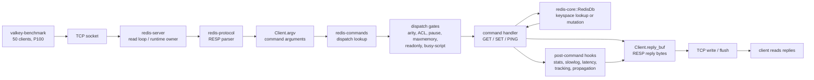
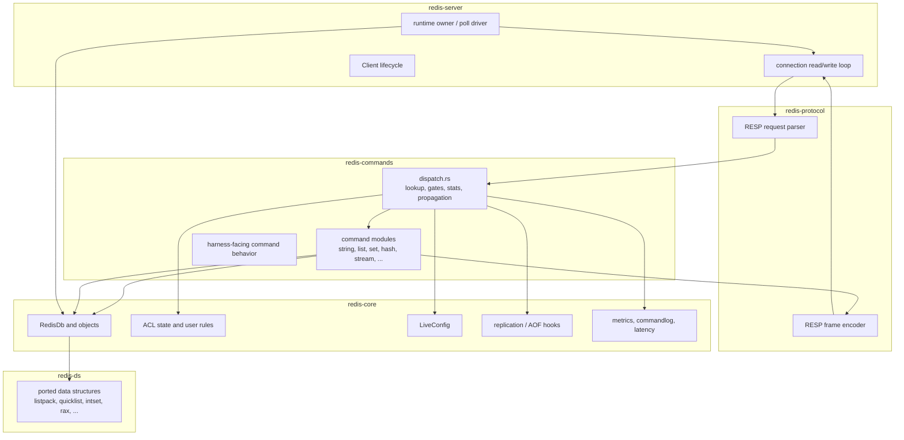
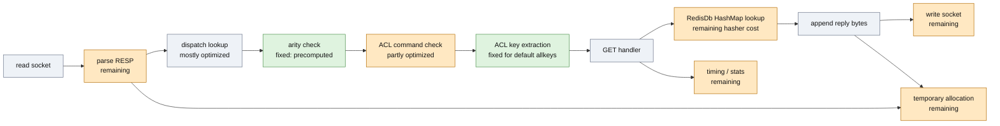
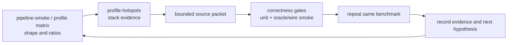

# Pipeline Hot Path System Diagram

Status date: 2026-05-26.

This is a working map for the current single-node request path and the P100
pipeline performance investigation. Numbers and hotspot labels are telemetry
from local `harness/bench` runs on the current development tree, not public
benchmark claims.

## One Request Batch

`valkey-benchmark -P 100` sends 100 RESP command frames without waiting for
each reply. The server has to parse, dispatch, execute, append replies, and
flush fast enough that the client can keep the socket full.



For `GET`, the actual key lookup is no longer the main story. The current gap
is mostly fixed per-command overhead around the lookup.

## Crate Boundaries



## Current Hot Path With Fixes

Green nodes are issues we found and mostly removed in this pass. Orange nodes
are still showing up in the latest samples.



## What We Already Learned

The original P100 collapse was not the `GET` implementation itself. It was
dispatch-side overhead amplified by 100-command client pipelines.

Measured slow parts already identified:

- Runtime ACL key-spec parsing in `dispatch.rs`: parsed JSON metadata on every
  command. Fixed by caching parsed key specs.
- ACL key extraction for unrestricted users: default `~*` users still paid key
  discovery before allowing the command. Fixed by skipping key extraction for
  `allkeys`.
- Generated-registry arity scan: dispatch scanned generated command specs per
  command. Fixed by storing arities in the runtime dispatch entry.
- ACL command success path: default `+@all` users still allocated/lowercased
  command names and cloned the authenticated user on the success path. Reduced
  with fast success checks and denial-only cloning.

Approximate result on local smoke runs:

```text
GET P100 before this pass:  ~456k rps, ~12 percent of upstream
GET P100 after this pass:   ~1.6M-1.8M rps, ~44-46 percent of upstream
```

Latest evidence files:

- `harness/bench/results/20260526T200519Z-676765a-pipeline-smoke.tsv`
- `harness/bench/results/20260526T201844Z-676765a-hotspots.json`

## Remaining Bottleneck Classes

The latest hotspot sample no longer has one dominant Redis command frame. The
remaining samples are spread across fixed per-command costs:

| Class | Current signal | Likely place to inspect |
|---|---|---|
| Parser | `redis_protocol::request::parse_inline_or_multibulk_into`, RESP integer reads | `redis-protocol/src/request.rs` |
| Allocation | `_nanov2_free`, `malloc`, `_free`, Rust alloc frames | argv construction, reply construction, temporary strings |
| Timing and stats | `mach_absolute_time` | `dispatch_command_name`, slowlog, latency, command stats |
| Hash lookup | SipHasher frames | `RedisDb` map lookup and key hashing |
| Socket I/O | `recvfrom`, `sendto` | read batching, reply buffering, flush behavior |
| Locks | `pthread_mutex_lock/unlock` | ACL/global metrics/registry state |

## Harness Feedback Loop



Good next packets should stay bounded and evidence-gated:

- `parser/allocation`: reduce per-command argv and parser allocations under
  deep pipelines.
- `observability gates`: make latency/commandlog/stat paths cheaper when they
  cannot record anything.
- `reply/write batching`: verify whether reply bytes are appended and flushed
  at the same granularity as upstream.
- `hashing`: evaluate whether `RedisDb` key lookup is paying too much for the
  default hasher on hot byte-string keys.
